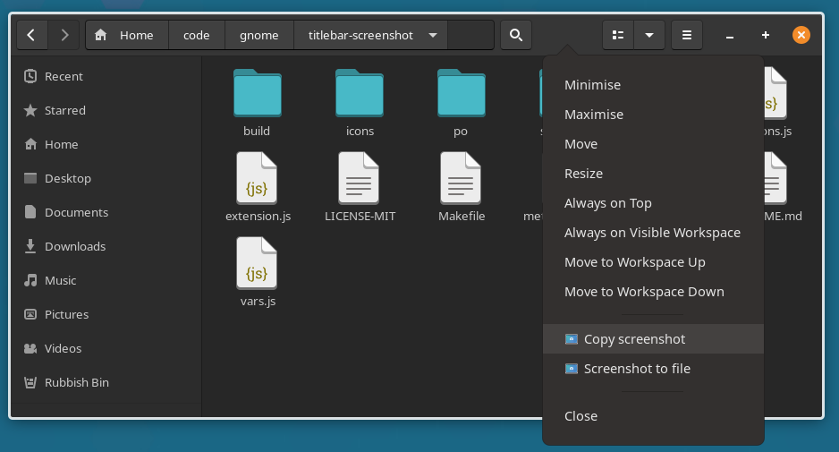

# Titlebar Screenshot

Adds items to the window menu to take screenshots of the current window. Just
right-click the titlebar and take a screenshot.



Screenshots are taken with [gnome-screenshot](https://gitlab.gnome.org/GNOME/gnome-screenshot/).

The current options are:

* **Copy screenshot**: screenshot the window and save it to the copy/paste buffer
* **Screenshot to file**: screenshot the window and save to a file
* **Screenshot tool**: open gnome-screenshot, ready to take a screenshot of the window

## Supported gnome versions

Supports **gnome 3.38** and **gnome 40** (including Ubuntu 21.04, Fedora 34, and
many other popular distributions).

Unless there's interest, support for other versions is unlikely because
[first-party for this feature is being worked on](https://thisweek.gnome.org/posts/2021/08/twig-7/#gnome-shell).

## Installation

Install from the [gnome extensions website](https://extensions.gnome.org/extension/4458/titlebar-screenshot/).

You can also install a release manually by downloading the zip of the release
and running

```
$ gnome-extensions install --force titlebar-screenshot@jmaargh.github.com.<VERSION>.zip
```

## Configuration

This extension is designed to be as configurable as possible, allowing users to
choose which options are shown in the menu, where in the menu they appear,
the exact text of the menu items, etc.

## Limitations

Since gnome-screenshot is used to actually take the screenshots, we are limited
to the options exposed by the gnome-screenshot command line interface.

For example, it is not currently possible to have the "Screenshot to tool"
option actually take the screenshot and open straight into the dialog letting
the user choose what to do with it.

To change the location that files are saved to, please see the configuration
for gnome-screenshot.

## Contributing and feedback

All contributions and feedback are welcome. Please open issues for

* Bugs
* Gnome version support
* Translations
* Feature requests

or anything else you can think of.

## License

You may choose to receive this under either the MIT license or the GPL version
2 license, both are attached.
